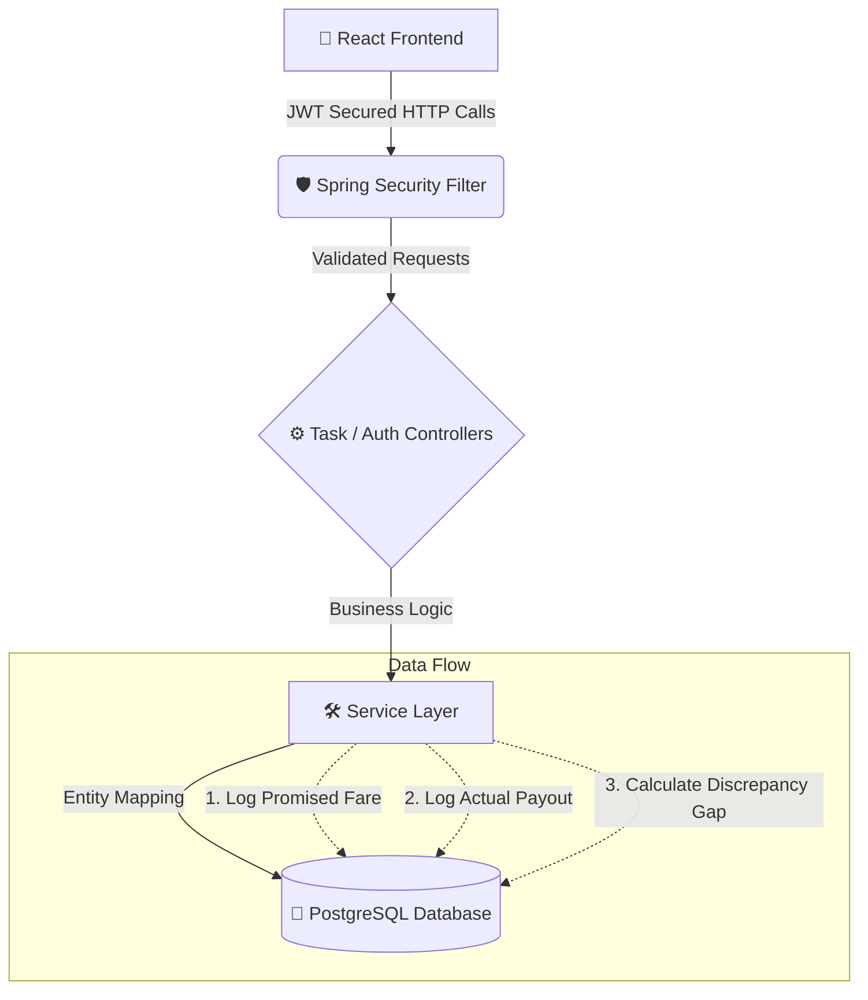

<div align="center">

# 📊 GigLedger

**An Independent, Tamper-Evident Pay Verification Platform for Gig & Delivery Workers**

[](#)
[](https://spring.io/projects/spring-boot)
[](https://www.postgresql.org/)
[](https://jwt.io/)

*Because every worker deserves a single source of truth for their hard-earned money.*

</div>

---

## 🚨 The Systemic Problem

Gig and delivery workers are paid on a per-task basis. Upon accepting a task, the platform shows a **promised fare**. However, the **actual amount** credited often differs due to unexplained deductions, hidden adjustments, or platform errors. 

Currently, workers have:
- ❌ **No independent record** of what was promised vs. received.
- ❌ **No ability to track** financial gaps over time.
- ❌ **No evidence** to prove if a single discrepancy is a one-off mistake or a sustained pattern of underpayment.

The platform's proprietary application is the sole record of truth.

## 💡 The GigLedger Solution

GigLedger empowers delivery partners to independently log, track, and verify their earnings. It acts as a secure, mobile-first, and tamper-evident ledger.

### 🏗️ High-Level Architecture



## 📂 Project Directory Structure

```text
gigledger/
├── backend/                       # Spring Boot Application
│   ├── src/main/java/com/gigledger/
│   │   ├── config/                # App & Security Configurations
│   │   ├── controller/            # REST API Endpoints (/auth, /tasks)
│   │   ├── dto/                   # Data Transfer Objects (Validation)
│   │   ├── entity/                # Database Models (User, Task, Payout)
│   │   ├── exception/             # Global Exception Handling
│   │   ├── repository/            # Spring Data JPA Interfaces
│   │   ├── security/              # JWT Filters & Stateless Auth
│   │   └── service/               # Core Business Logic
│   └── src/main/resources/        # env-driven application.properties
│
├── frontend/                      # React + Vite Application
│   ├── public/                    # Static Assets
│   ├── src/
│   │   ├── assets/                # Images & Global CSS
│   │   ├── components/            # Reusable UI Components
│   │   ├── context/               # React Auth Context (JWT State)
│   │   ├── pages/                 # Dashboard, Login, Signup Views
│   │   ├── services/              # Axios API Clients
│   │   └── App.jsx                # Main Router
│   └── package.json               # Dependencies
│
└── setup_db.sql                   # Database initialization script
```

## 🔐 Security & Hardening

GigLedger is built with strict financial and data privacy standards:

1. **Stateless JWT Auth:** No session cookies. Every request is verified via a securely signed JSON Web Token.
2. **Data Isolation:** Service-level ownership checks (`HTTP 403 Forbidden`) ensure a user can *never* query or mutate another worker's tasks.
3. **Strict Validation:** Edge-case protection using DTO annotations (`@Positive`, `@NotBlank`) prevents corrupted or impossible data (e.g., negative payouts).
4. **Environment Secrets:** Zero hardcoded credentials. Passwords and JWT signatures are injected via `.env` files.

## 🚀 Future Roadmap

- [ ] **Phase 2 — OCR Integration:** Automatically extract promised fares and distances from worker screenshots to eliminate manual typing.
- [ ] **Phase 2 — Statistical Analysis:** Algorithmically flag sustained underpayment patterns.
- [ ] **Phase 3 — Immutable Ledgers:** Generate tamper-evident PDF/hash exports for indisputable proof in disputes.
